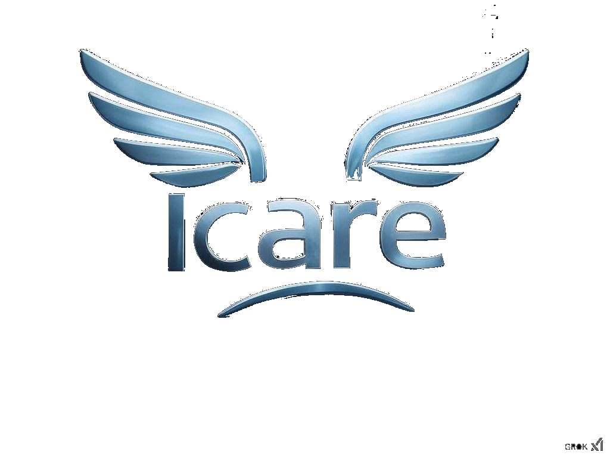

# Icare

Fondamentalement, ce projet est un système automatisé de création d'horaires basé sur un système approfondi de suivi et de gestion des contraintes.

## Features

(✅/❌)


|                                                            Type                                                            | Status |
|:--------------------------------------------------------------------------------------------------------------------------:| :---: |
|                                Systeme de creation de compte / permissions (avec heredité)                                 | ❌ |
|                                                  Permissions approfondis                                                   | ❌ |
|                       Ajout d'un emploi du temps personnel et de restrictions pour la creation d'EDT                       | ❌ |
|                            Systeme de point pour egaliser les horaires de chaque prof / classe                             | ❌ |
|                                                Systeme de gestion de salle                                                 | ❌ |
|                                         Algorithme de creation automatique des EDT                                         | ❌ |
|                                           Gestion des matières / prof referents                                            | ❌ |
|                         Gestion du sens des horaires (Example : Le CM3 doit être avant le TD3 ...)                         | ❌ |
|                                         Modification manuelle des emploi du temps                                          | ❌ |
|                                               Modification en local de l'EDT                                               | ❌ |
| Systeme de back-up pour revenir en arrière dans les modifications + voir qui a fait les dernières modifications / horaires | ❌ |

## Installation Guide

### On dev system (need PHP on you're computer)
```
php -S 127.0.0.1:8000
```
### On server
```
(Not implement)
```
## User List
- [x] Admin : http://127.0.0.1:8000/?UUID=22401769
- [x] Basic User : http://127.0.0.1:8000/?UUID=22305450

## License
```
Icare © 2025 by Arthur (Infuseting) is licensed under CC BY-NC-ND 4.0
```

